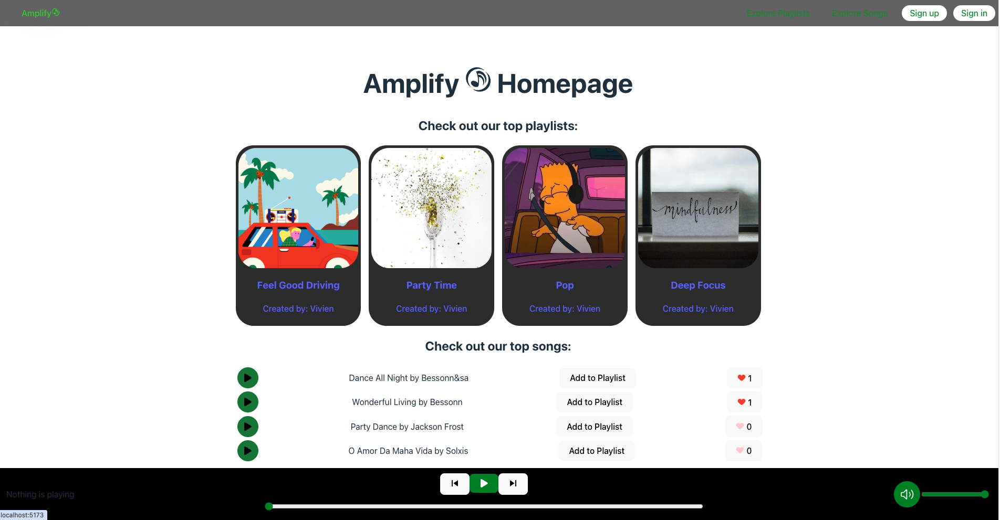
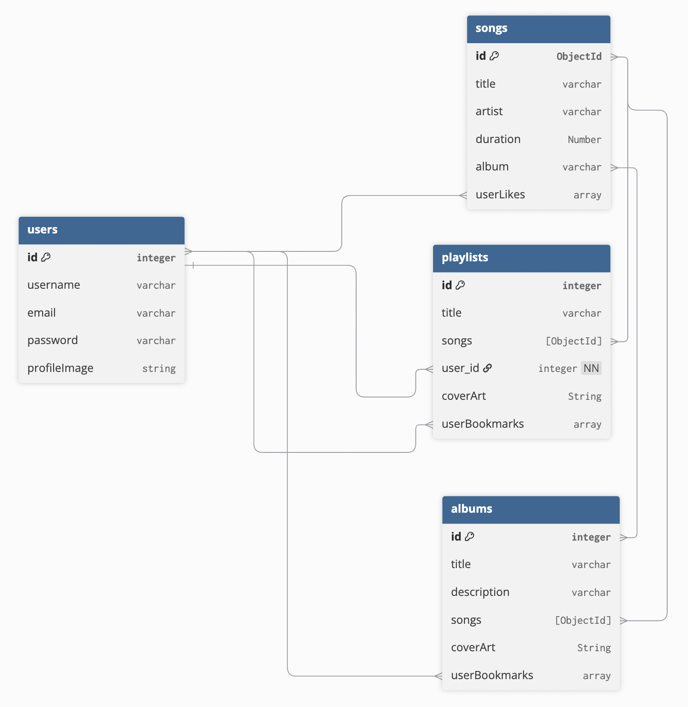
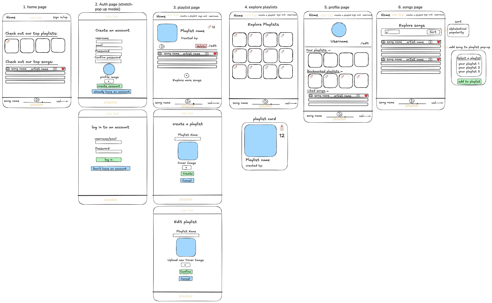
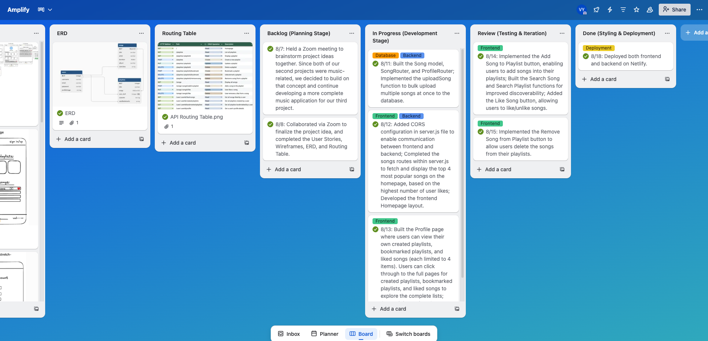
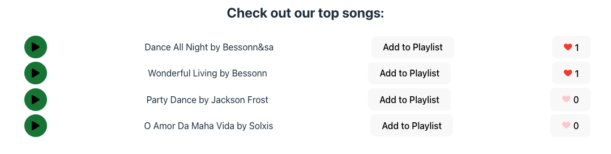
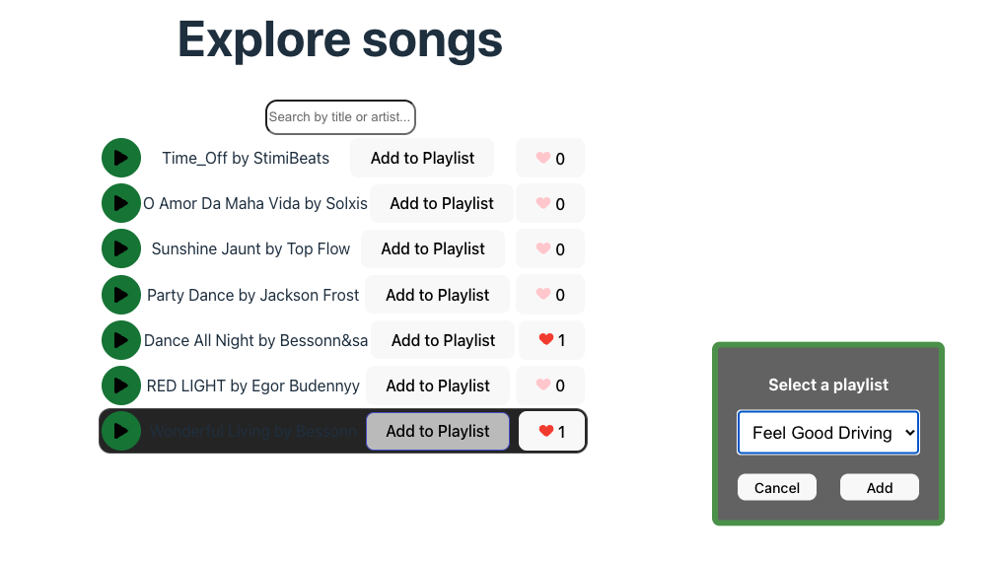

# Amplify 🎵

Description: Amplify is a full-stack music player web application that allows users to discover, listen to, and manage playlists and songs.  

Without signing in, users can browse the **homepage** to see the most popular playlists and songs, explore the **Explore Playlists** page, and explore the **Explore Songs** page. However, any actions such as playing a song, liking a song, or adding a song to a playlist will automatically redirect the user to the **Sign In** page to continue.  

Once signed in, the homepage displays the **top 4 most popular playlists** (based on user bookmarks) and the **top 4 most liked songs**. Users can create their own playlists, add songs to playlists, bookmark any playlists they like, and like their favorite songs. This provides a personalized music experience while encouraging user engagement and content discovery.



## Deployment link

- Frontend: https://amplify-zone.netlify.app/

- Backend: https://amplify-zone-api.netlify.app/

## Getting Started / Code Installation

Follow these steps to run the project locally (Clone **backend** and **frontend** separately):

### Set up backend

1. Clone the backend repository

   `git clone https://github.com/bihuiy/Music-Player-api.git`

   `cd Music-Player-api`

2. Install dependencies `npm install`

3. Set up environment variables

   Create a .env file in the root directory and add the following variables:

   `PORT=3000`

   `MONGODB_URI=your-mongodb-url`

   `TOKEN_SECRET=your-token-secret`

   `FRONT_END_URL=http://localhost:5173` # URL of your frontend

4. Start the development server `npm run dev` (Start the backend first, then, in a separate terminal, start the frontend)

### Set up frontend

1. Clone the frontend repository (in a separate folder)

   `git clone https://github.com/bihuiy/Music-Player-FrontEnd.git`

   `cd Music-Player-FrontEnd`

2. Install dependencies `npm install`

3. Set up environment variables

   Create a .env file in the root directory and add the following variables:

   `VITE_API_URL=http://localhost:3000/api` # URL of your backend

   `VITE_CLOUDINARY_URL=your-cloudinary-url`

   `VITE_UPLOAD_PRESET=your-upload-preset`

4. Start the development server `npm run dev`

Open http://localhost:5173 to view the app in your browser.

## Timeframe & Working Team (Solo/Pair/Group)

This project was completed over one week, from 7th August to 18th August 2025, in a team of two. I collaborated with Max Rowe on this project

- Backend: https://github.com/JMaxRowe/Music-Player-api

- Frontend: https://github.com/JMaxRowe/Music-Player-FrontEnd

## Technologies Used

**Front End**

- React (with React Router for client-side routing)
- React Hooks (useState, useEffect, useContext for state management)
- Axios (For AJAX requests to the backend)
- React Icons (For UI elements (e.g. like/unlike button))
- CSS (Styling)

**Back End**

- Node.js (Runtime environment)
- Express.js (RESTful API development)
- MongoDB & Mongoose (Database and ODM)
- JWT Authentication and authorization (JSON Web Tokens)
- Bcrypt (Password hashing and security)

**Development Tools**

- Git & GitHub (Version control, branching, pull requests, and collaboration)
- Postman (API testing)
- VS Code (Main IDE for development)
- Zoom (Team communication and pair programming)
- Netlify (Frontend & Backend deployment)

## Brief

The goal of this project was to build a full-stack music player application that allows users to discover, explore, and manage music content in an interactive and personalized way.  

Key objectives included:  
- Allowing users to browse popular playlists and songs on the homepage.  
- Enabling users to explore all playlists and songs through dedicated pages.  
- Implementing user authentication so that actions like liking a song, adding a song to a playlist, or bookmarking playlists are only available after signing in.     

## Planning

### 1. User Stories

I started by writing user stories to clarify what features the app needed.

> As a user, I want to visit the homepage, so that I can explore the app’s features.
>
> As a user, I want to see playlists, so that I can discover popular content quickly.
>
> As a user, I want to open a playlist, so that I can explore the songs inside.
>
> As a user, I want to browse songs, so that I can discover new music.
>
> As a user, I want to sign up, so that I can create a personal account.
>
> As a user, I want to sign in, to listen to music.
>
> As a logged-in user, I want to create a playlist, so that I can organise my songs.
>
> As a logged-in user, I want to add songs to my playlists, so that I can build my own music library.
>
> As a logged-in user, I want to edit my playlists, so that I can update them when needed.
>
> As a logged-in user, I want to delete my playlists, so that I can remove the ones I no longer need.
>
> As a logged-in user, I want to sign out, so that I can keep my account secure.
>
> Stretch: As a logged-in user, I want to bookmark my favourite playlists, so that I can access them easily.
>
> Stretch: As a logged-in user, I want to like my favourite songs, so that I can show appreciation and save them for later.
>
> Stretch: As a user, I want to filter songs by artist/album/search, so that I can find specific music quickly.
>
> Stretch: As a user, I want to filter playlists by search, so that I can discover the playlists I’m interested in.
>
> Stretch: As a user, I want to explore albums, so that I can listen to songs in context of their albums.

### 2. ERD (Entity-Relationship Diagram)

I identified the key entities (users, songs, playlists) and their relationships.



### 3. Routing Table

I mapped out all API endpoints to ensure a consistent RESTful design.

| Route                                | Method | CRUD Operation | Description                            |
| ------------------------------------ | ------ | -------------- | -------------------------------------- |
| `/`                                  | GET    | Read           | Homepage                               |
| `/playlists`                         | GET    | Read           | List all playlists                     |
| `/playlists/:playlistId`             | GET    | Read           | Display a playlist                     |
| `/playlists`                         | POST   | Create         | Create a new playlist                  |
| `/playlists/:playlistId`             | PUT    | Update         | Update a playlist                      |
| `/playlists/:playlistId`             | DELETE | Delete         | Delete a playlist                      |
| `/playlists/:playlistId/bookmark`    | POST   | Create         | Bookmark a playlist                    |
| `/playlists/:playlistId/bookmark`    | DELETE | Delete         | Unbookmark a playlist                  |
| `/playlists/:playlistId/remove-song` | DELETE | Delete         | Remove a song from a playlist          |
| `/songs`                             | GET    | Read           | Display all songs                      |
| `/songs/:songId/add-to-playlist`     | POST   | Create         | Add a song to the playlist             |
| `/songs/:songId/like`                | PUT    | Update         | User likes a song                      |
| `/songs/:songId/like`                | DELETE | Delete         | User removes a like from a song        |
| `/user/:userId/liked-songs`          | GET    | Read           | Get all songs liked by a user          |
| `/user/:userId/created-playlists`    | GET    | Read           | Get all playlists created by a user    |
| `/user/:userId/bookmarked-playlists` | GET    | Read           | Get all playlists bookmarked by a user |
| `/user/:userId/profile`              | GET    | Read           | Get a user's profile details           |

### 4. Wireframes



### 5. Trello Board

I used **Trello** to track our daily tasks and manage the overall progress of this project.

Below is a screenshot of my Trello board, which includes columns for **Backlog**, **In Progress**, **Review**, and **Done**.

- **Backlog:** Project ideas, sketches, planning documents
- **In Progress:** Current coding tasks
- **Review:** Features under testing and debugging
- **Done:** Completed features ready for deployment

Below is an overview of my development timeline mapped to these stages:



> A detailed day-by-day breakdown of the development process can be found in the **Build/Code Process** section below.

## Build / Code Process

Below is my detailed day-by-day breakdown of the development process, which I originally documented on my Trello board. I contributed mainly to the **Homepage**,**Song** and **Profile** features.

### Backlog (Planning Stage)

- 8/7: Held a Zoom meeting to **brainstorm** project ideas together. Since both of our second projects were music-related, we decided to build on that concept and continue developing a more complete music application for our third project.
- 8/8: Collaborated via Zoom to finalize the project idea, and completed the **User Stories**, **Wireframes**, **ERD**, and **Routing Table**.

### In Progress (Development Stage)

- 8/11:
  - Built the `Song` model, `SongRouter`, and `ProfileRouter`.
  - Implemented the `uploadSong` function to bulk upload multiple songs at once to the database.
- 8/12:

  - Added **CORS configuration** in `server.js` to enable communication between frontend and backend.
  - Completed the songs routes within server.js to fetch and display the top 4 most popular songs on the homepage, based on the highest number of user likes.
  - Developed the frontend **Homepage** layout.

- 8/13:
  - Built the **Profile** page where users can view their own created playlists, bookmarked playlists, and liked songs (each limited to 4 items). Users can click through to the full pages for created playlists, bookmarked playlists, and liked songs to explore the complete lists. <sup>[code snippet 1: Profile Data Route]</sup>
  - Created the **Explore Songs** page to browse all available songs.

### Review (Testing & Iteration)

- 8/14:
  - Implemented the **Add Song to Playlist** button, enabling users to add songs into their playlists.
  - Built the **Search Song** and **Search Playlist** functions for improved discoverability. <sup>[code snippet 2: Search Songs Function]</sup>
  - Added the **Like Song** button, allowing users to like/unlike songs.
- 8/15: Implemented the **Remove Song from Playlist** button to allow users delete the songs from their playlists.

### Done (Styling & Deployment)

- 8/18: Deployed both frontend and backend on Netlify.

### Code Snippets

1. Profile Data Route：

**Goal:** Provide the frontend Profile page with the necessary data so users can see their created playlists, bookmarked playlists, and liked songs. Each limited to 4 items for a preview. Users can then navigate to the full pages to explore complete lists. This approach keeps the Profile page lightweight and user-friendly by only returning a preview of each section.

```js
// * get a user's profile details
router.get("/:userId/profile", verifyToken, async (req, res, next) => {
  try {
    const userId = req.params.userId;
    const user = await User.findById(userId);

    // first 4 playlists created by this userId
    const createdPlaylists = await Playlist.find({ owner: userId })
      .populate("owner")
      .limit(4);

    // first 4 playlists bookmarked by this userId
    const bookmarkedPlaylists = await Playlist.find({
      userBookmarks: userId,
    })
      .populate("owner")
      .limit(4);

    // first 4 songs liked by this userId
    const likedSongs = await Song.find({ userLikes: userId }).limit(4);

    return res.json({
      user,
      createdPlaylists,
      bookmarkedPlaylists,
      likedSongs,
    });
  } catch (error) {
    next(error);
  }
});
```

2. Search Songs Function:

**Goal:** Allow users to search for songs by title or artist, making it easier to discover music without manually browsing long lists. I built a simple utility function `searchSongs` that takes in all songs and a search query. If the query is empty, it returns the full list. Otherwise, it filters songs by checking whether the query matches either the song’s title or the artist’s name (case-insensitive).

```js
export function searchSongs(songs, query) {
  if (!query) return songs;

  const lowerQuery = query.toLowerCase();

  return songs.filter(
    (song) =>
      song.title.toLowerCase().includes(lowerQuery) ||
      song.artist.toLowerCase().includes(lowerQuery)
  );
}
```

## Challenges: Implementing the Like/Unlike Song Feature

When I first implemented the Like button, I set the initial state of `liked` to `false` for all songs. This seemed to work, once a user clicked the button, the state changed to `true`, and the icon updated correctly. However, after I refreshing the page, all songs appeared unliked again, even if the user had previously liked them.

Then I realized this was because the initial state was hardcoded as `false`, rather than reflecting the true relationship between the user and the song stored in the database.

I found out the initial value for `liked` should come from checking whether the current user ID exists inside the song’s `userLikes` array (from the backend). So instead of setting `false` by default, I set:

```js
const [liked, setLiked] = useState(
  user ? song.userLikes.includes(user._id) : false
);
```

At the same time, I wanted to not only display the two heart icons (`FcLike` and `FcLikePlaceholder`) to represent like/unlike visually, but also to show the **number of likes** each song had. Since the `userLikes` field in my `Song` model is an array of user IDs, I used its length as the initial value of `likesCount`:

```js
const [likesCount, setLikesCount] = useState(song.userLikes.length);
```

Every time a user liked a song, I incremented likesCount by 1, and when they unliked, I decremented it by 1. This simple approach ensured the counter always stayed in sync with the backend.

This solved the refresh issue and made the Like button feel much more reliable. It also enabled me to extend the feature so that we could display the Top 4 most popular songs on the homepage, ranked by number of likes.



## Wins: Reusable "Add Song to Playlist" Modal

One of the features I’m most proud of is the **Add Song to Playlist** modal. I had already implemented a similar feature in my previous music playlist app, but this time I rebuilt it using a React version of the modal to better fit the Amplify project.

**What I did:**

- Created a standalone `AddToPlaylistModal` component using `react-bootstrap` that lets users select one of their playlists and add the chosen song.
- Built a wrapper component `AddToPlaylistWrapper` that manages modal state, fetches the logged-in user’s playlists, and handles the logic of opening/closing the modal.
- Designed it as a **reusable component** so it can be invoked from multiple pages (e.g., homepage, explore songs, profile) simply by calling `handleOpenModal(song)` and rendering `modalComponent`.



## Key Learnings / Takeaways

This project was very different from my previous solo projects because it was a **team collaboration**.  
I learned not only to work on the technical side, but also how to **communicate, plan, and coordinate effectively** with a teammate.

- **Collaboration & Communication**: We continuously discussed ideas, refined our planning, and kept each other updated on progress through frequent Zoom meeting. This ensured we stayed aligned and could redistribute unfinished work as needed.
- **GitHub Workflow**: Unlike solo projects where I could simply commit and push, here I learned to use proper GitHub workflows:
  - Working on individual branches
  - Regularly committing and pushing changes
  - Creating pull requests and merging carefully
- **Conflict Management**: Thanks to proactive communication (notifying each other before pushing), we avoided most merge conflicts. Only one or two conflicts occurred during the project, which we resolved smoothly.

This experience gave me much more confidence in collaborating within a team, managing codebases with multiple contributors, and maintaining smooth workflows with version control tools.
